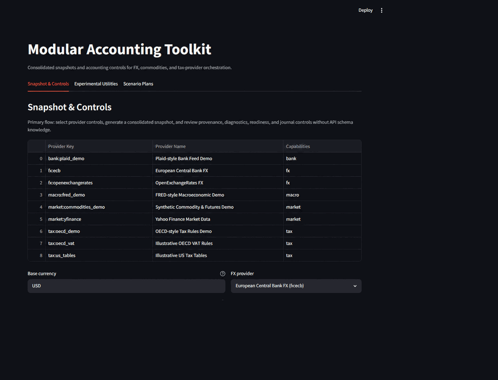

# Modular Accounting

A modular Python accounting toolkit that separates ledger and financial-control logic from replaceable FX, commodity, and tax-data providers.

## Streamlit demonstration interface using controlled sample data



## Why This Toolkit Matters

- Accounting teams need reproducible controls even when data providers change.
- Finance-systems teams need clear provenance, freshness, and health visibility.
- Hiring managers need concrete evidence of modular architecture plus operational quality gates.

## Verified Core Capabilities

- Consolidated snapshot orchestration across FX, commodity, and tax providers.
- Provider provenance, cache metrics, freshness diagnostics, and readiness/health visibility.
- Journal control primitives for balanced postings and account traceability.
- Operational CLI and API surfaces for snapshot, scenario plans, and diagnostics.
- Regression-tested Streamlit interface focused on snapshot controls for employer review.

## Architecture Diagram


## Quick-Start Demonstration

1. Install dependencies and configure PYTHONPATH:

```bash
python -m venv .venv
source .venv/bin/activate
make install
export PYTHONPATH="$PWD/src${PYTHONPATH:+:$PYTHONPATH}"
```

On Windows PowerShell:

```powershell
$env:PYTHONPATH = "$PWD\src"
```

1. Start API:

```bash
python -m uvicorn apps.api.main:app --host 127.0.0.1 --port 8000
```

1. Run Streamlit demonstration:

```bash
streamlit run src/apps/web/app.py
```

1. Optional CLI snapshot and scenario proof:

```bash
python -m cli.macli snapshot --base USD --commodity XAU --jurisdiction US --format table
python -m cli.macli inspect-plan --plan docs/examples/scenario-plan.json
python -m cli.macli snapshot-scenarios --plan docs/examples/scenario-plan.json --format table
```

## Employer Review Links

- [Foreign-currency accounting case study](docs/examples/foreign_currency_accounting_case_study.md)
- [End-to-end snapshot and control demonstration](docs/examples/end_to_end_snapshot_demo.md)
- [Public release audit evidence](PUBLIC_RELEASE_AUDIT.md)
- [Latest audit metrics artifact](docs/reports/audit-latest.md)

## Testing And Release Evidence

- Local and clean-clone quality-gate evidence is tracked in [PUBLIC_RELEASE_AUDIT.md](PUBLIC_RELEASE_AUDIT.md).
- Hosted CI run evidence and artifact disposition are tracked in the same audit file.
- Changelog and release notes live in [docs/CHANGELOG.md](docs/CHANGELOG.md) and [docs/RELEASE_NOTES.md](docs/RELEASE_NOTES.md).

## Repository Structure

| Path | Description |
| ---- | ----------- |
| [src/apps/](src/apps/README.md) | Implemented Python service packages, including the Streamlit demonstration interface in `src/apps/web/app.py`. |
| [apps/web/app.py](apps/web/app.py) | Compatibility and test launcher shim that executes `src/apps/web/app.py`. |
| [apps/react-ui/](apps/react-ui/README.md) | Experimental placeholder React surface (not part of the validated accounting runtime). |
| [src/cli/](src/cli/README.md) | Demo and operational CLI entry points. |
| [src/plugins/](src/plugins/README.md) | Provider and extension reference plugins. |
| [src/tools/](src/tools/README.md) | Quality-gate, audit, and release tooling. |
| [docs/](docs/README.md) | Architecture, examples, operations, governance, and reports. |
| [tests/](tests/README.md) | Full regression suites, including Streamlit AppTest coverage. |

## Additional Documentation

- [Setup guide](docs/setup.md)
- [Architecture overview](docs/architecture/overview.md)
- [Adapter contracts](docs/adapters.md)
- [Extension guide](docs/guides/extension_guide.md)
- [Operations playbook](docs/operations/automation_playbook.md)
- [Security and dependency posture](docs/SECURITY.md)
- [Roadmap](docs/roadmap.md)

## License And Contribution

This repository is licensed under the [Apache License 2.0](LICENSE). Attribution is recorded in [NOTICE](NOTICE).

Contributions are welcome. Review [docs/CONTRIBUTING.md](docs/CONTRIBUTING.md), [docs/CODE_OF_CONDUCT.md](docs/CODE_OF_CONDUCT.md), and [docs/SECURITY.md](docs/SECURITY.md) before opening a change.
