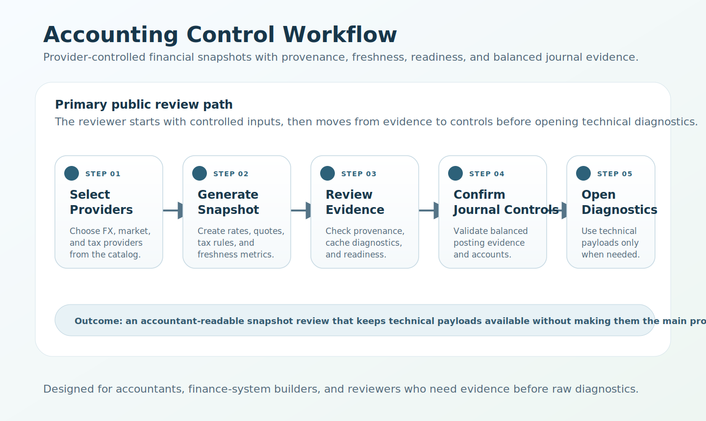

# Modular Accounting

A modular accounting-control toolkit for validating financial snapshots, provider provenance, and journal integrity without committing to a full ERP.

The project demonstrates how accounting workflows can be broken into auditable modules: FX rates, commodity pricing, tax rules, ledger controls, provider health, cache diagnostics, and scenario plans. It is intentionally smaller than an ERP and focused on transparent controls, reproducible evidence, and clean integration boundaries.

## Streamlit demonstration interface using controlled sample data


Demo providers use controlled sample data unless external API credentials are configured. The public review flow is intended to show provider-swappable controls, provenance, and journal evidence without claiming to be a production tax, treasury, or bank-feed system.

## Who This Is For

- Accountants who want clearer control evidence around rates, rules, and journal postings.
- Finance-system builders who need provider-swappable architecture.
- Hiring managers reviewing accounting automation, data provenance, and operational discipline.
- Developers building small, auditable accounting modules instead of monolithic ERP features.

## Why This Toolkit Matters

- Accounting teams need reproducible controls even when data providers change.
- Finance-systems teams need clear provenance, freshness, and health visibility.
- Hiring managers need concrete evidence of modular architecture plus operational quality gates.

## Scope

| This project demonstrates | This project does not claim to be |
|---|---|
| Provider-backed financial snapshots | A full ERP |
| FX, commodity, and tax-rule orchestration | A production tax engine |
| Balanced journal-control examples | A complete GL/subledger platform |
| Provenance, diagnostics, and health checks | Treasury execution software |
| CLI/API/Streamlit review surfaces | A commercial accounting product |

## Verified Core Capabilities

- Consolidated snapshot orchestration across FX, commodity, and tax providers.
- Provider provenance, cache metrics, freshness diagnostics, and readiness/health visibility.
- Journal control primitives for balanced postings and account traceability.
- Operational CLI and API surfaces for snapshot, scenario plans, and diagnostics.
- Regression-tested Streamlit interface focused on snapshot controls for portfolio review.

## Architecture Diagram


## Accounting Control Workflow



The primary review path is evidence-first: choose controlled providers, run a financial snapshot, review source evidence and freshness, confirm journal-control status, then open technical diagnostics only when needed.

## Quick-Start Demonstration

1. Create and activate a virtual environment, then install the validated development requirements:

```bash
python -m venv .venv
source .venv/bin/activate
python -m pip install --upgrade pip
python -m pip install -r requirements-dev.txt
export PYTHONPATH="$PWD/src${PYTHONPATH:+:$PYTHONPATH}"
```

On Windows PowerShell:

```powershell
python -m venv .venv
.\.venv\Scripts\Activate.ps1
python -m pip install --upgrade pip
python -m pip install -r requirements-dev.txt
$env:PYTHONPATH = "$PWD\src"
```

2. Start the API:

```bash
python -m uvicorn apps.api.main:app --host 127.0.0.1 --port 8000
```

3. Run the Streamlit demonstration in another activated shell:

```bash
streamlit run src/apps/web/app.py
```

4. Optional CLI snapshot and scenario proof:

```bash
python -m cli.macli snapshot --base USD --commodity XAU --jurisdiction US --format table
python -m cli.macli inspect-plan --plan docs/examples/scenario-plan.json
python -m cli.macli snapshot-scenarios --plan docs/examples/scenario-plan.json --format table
```

For Docker Compose, configuration, validation, and troubleshooting, use the [setup guide](docs/setup.md).

## Portfolio Review Links

- [Foreign-currency accounting case study](docs/examples/foreign_currency_accounting_case_study.md)
- [End-to-end snapshot and control demonstration](docs/examples/end_to_end_snapshot_demo.md)
- [Public release audit evidence](PUBLIC_RELEASE_AUDIT.md)
- [Latest audit metrics snapshot](docs/reports/audit-latest.md) - technical supporting evidence only; see the public audit for the release verdict.

## Testing And Release Evidence

- Local and clean-clone quality-gate evidence is tracked in [PUBLIC_RELEASE_AUDIT.md](PUBLIC_RELEASE_AUDIT.md).
- Hosted CI run evidence and artifact disposition are tracked in the same audit file.
- Changelog and release notes live in [docs/CHANGELOG.md](docs/CHANGELOG.md) and [docs/RELEASE_NOTES.md](docs/RELEASE_NOTES.md).

## Repository Structure

| Path | Description |
| ---- | ----------- |
| [src/apps/](src/apps/README.md) | Implemented Python service packages, including the Streamlit demonstration interface in `src/apps/web/app.py`. |
| [apps/web/app.py](apps/web/app.py) | Compatibility and test launcher shim that executes `src/apps/web/app.py`. |
| `apps/react-ui/` | Experimental React source directory (not part of the validated accounting runtime). |
| [src/cli/](src/cli/README.md) | Demo and operational CLI entry points. |
| [src/plugins/](src/plugins/README.md) | Provider and extension reference plugins. |
| [src/tools/](src/tools/README.md) | Quality-gate, audit, and release tooling. |
| [docs/](docs/README.md) | Architecture, examples, operations, governance, and reports. |
| [tests/](tests/README.md) | Full regression suites, including Streamlit AppTest coverage. |

## Additional Documentation

- [Setup guide](docs/setup.md)
- [Architecture overview](docs/architecture/overview.md)
- [Adapter contracts](docs/adapters.md)
- [Extension guide](docs/guides/extension_guide.md)
- [Operations playbook](docs/operations/automation_playbook.md)
- [Security and dependency posture](docs/SECURITY.md)
- [Roadmap](docs/roadmap.md)

## License And Contribution

This repository is licensed under the [Apache License 2.0](LICENSE). Attribution is recorded in [NOTICE](NOTICE).

Contributions are welcome. Review [docs/CONTRIBUTING.md](docs/CONTRIBUTING.md), [docs/CODE_OF_CONDUCT.md](docs/CODE_OF_CONDUCT.md), and [docs/SECURITY.md](docs/SECURITY.md) before opening a change.
