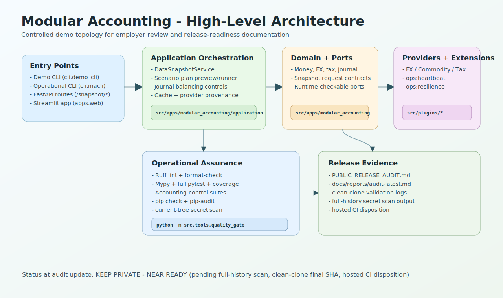
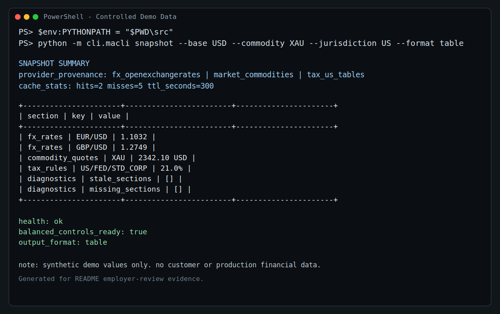
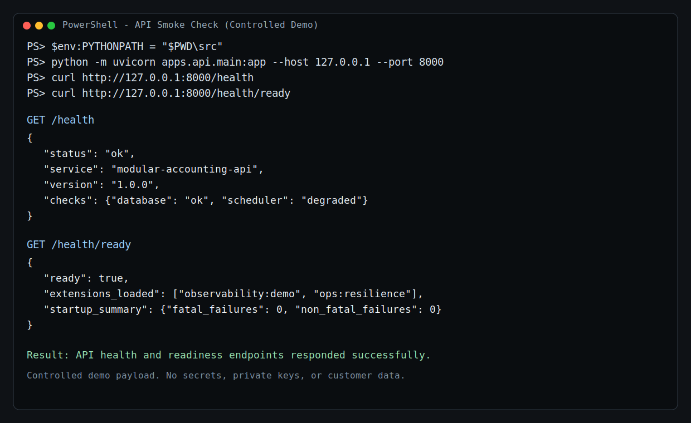
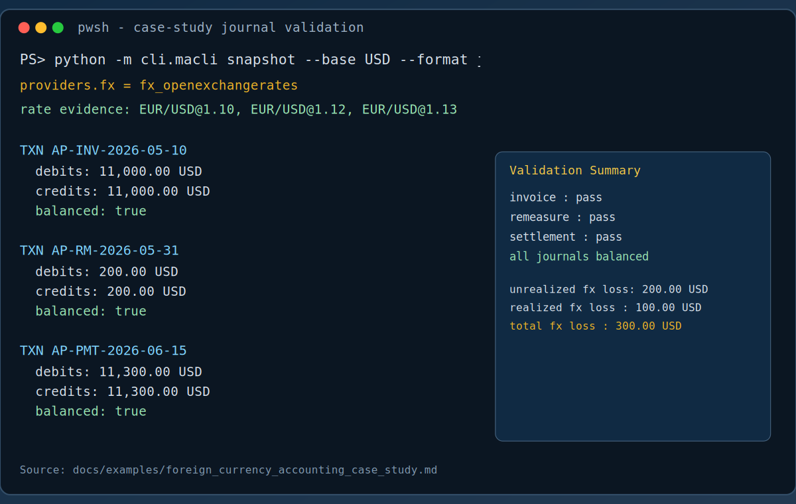
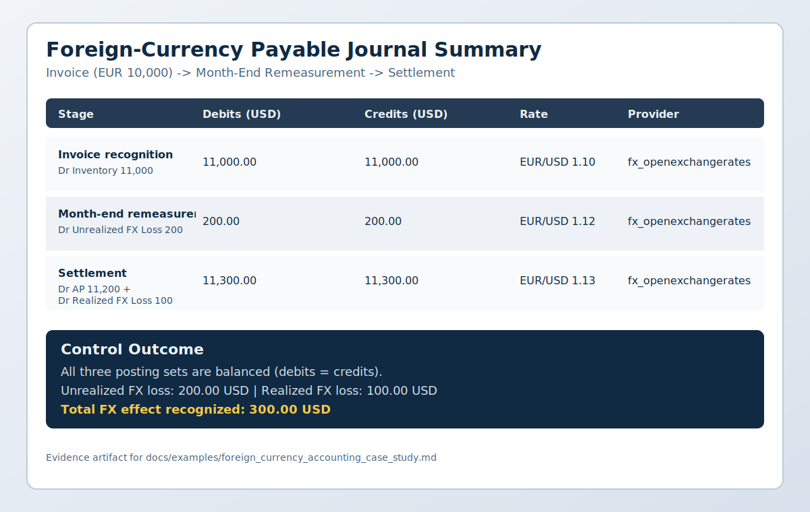

# Modular Accounting

A portable, modular accounting toolkit with pluggable data sources for tax, foreign exchange, and commodity pricing. The project ships with lightweight domain models, adapter contracts, and a demo CLI so teams can stitch together finance workflows without committing to a heavyweight stack.

## At A Glance

High-level architecture diagram:



Controlled CLI snapshot (consolidated FX, commodity, and tax data):



Controlled API health/readiness snapshot:



Foreign-currency case-study terminal and journal evidence:




## What

- **Domain primitives** for money, FX rates, commodity quotes, tax rules, and journal transactions under `src/apps/modular_accounting/domain`.
- **Adapter contracts** describing how to load tax, FX, and commodity data in `src/apps/modular_accounting/domain/ports.py` plus in-memory reference implementations in `src/apps/modular_accounting/adapters`.
- **Snapshot orchestration** service in `src/apps/modular_accounting/application` that coordinates adapters and returns a consolidated view of rates, quotes, and rules via immutable `SnapshotRequest` payloads.
- **Demo CLI** (`python -m cli.demo_cli snapshot`) that streams adapter output as JSON for quick experiments or integration smoke tests.

## Toolkit Scope

- **In scope**: accounting data snapshots, adapter-driven FX/commodity/tax inputs, journal balancing primitives, operational CLI workflows, and extensible provider loading.
- **Out of scope**: opinionated ERP workflows, custody/treasury execution, and production-grade React UI (the current React surface is a placeholder scaffold).
- **Validation source of truth**: publication readiness is tracked in [`PUBLIC_RELEASE_AUDIT.md`](PUBLIC_RELEASE_AUDIT.md). Current status is `KEEP PRIVATE - NEAR READY` until full-history secret scanning, final clean-clone validation, and CI disposition are recorded for the publication commit.

## Why

- Keep accounting workflows **portable**: swap adapters without rewriting downstream logic.
- Make integrations **composable**: treat each data source as an interchangeable plugin.
- Provide a **clear starting point** for teams that want to layer tax, FX, or commodities intelligence on top of core ledgers.

## Python Version Policy

- **Minimum supported version**: Python 3.12
- **Primary development version**: Python 3.14
- **Latest validated version**: Python 3.14
- **CI workflow matrix**: Python 3.12, 3.13, and 3.14

Compatibility is maintained across supported versions unless a documented
dependency or interpreter regression requires a scoped exception.

## How

1. Install dependencies and activate a virtual environment:

   ```bash
   python -m venv .venv
   source .venv/bin/activate
   make install
   export PYTHONPATH="$PWD/src${PYTHONPATH:+:$PYTHONPATH}"
   ```

   On Windows PowerShell, use `$env:PYTHONPATH = "$PWD\src"` from the
   repository root before running direct `python -m cli...` commands.

2. Run the demonstration CLI to view a consolidated snapshot:

   ```bash
   python -m cli.demo_cli snapshot --base USD --commodity XAU --commodity XAG --format table
   ```

   The `--format` flag toggles between JSON and a friendly ASCII table so you can choose the representation that works best for demos, debugging, or documentation snippets. Input is validated before adapters run to save round trips. Pass `--include-diagnostics` to append health metadata such as missing sections, quote staleness, and active tax rules.
3. Use the operational CLI to build snapshots with real providers (it auto-selects the first configured providers unless you pass explicit overrides such as `--fx-provider`):

   ```bash
   python -m cli.macli snapshot --base USD --commodity XAU --jurisdiction US --format table
   ```

   The command reuses the configured provider plugins, surfaces cache statistics, and prints provider provenance so you can audit inputs. Swap `--format json` to emit a machine-friendly payload that includes cache metrics and request metadata.
4. Inspect and execute batch plans when you need to compare multiple markets or jurisdictions in one go:

   ```bash
   python -m cli.macli inspect-plan --plan docs/examples/scenario-plan.json
   python -m cli.macli snapshot-scenarios --plan docs/examples/scenario-plan.json --format table
   ```

   Plans are simple JSON or TOML files describing each scenario. Start with `inspect-plan` to verify metadata, defaults, and coverage; then run `snapshot-scenarios` to emit per-scenario diagnostics and aggregated summaries. Automate previews with `POST /snapshot/plans/preview` before triggering `/snapshot/scenarios` from CI pipelines.
5. Implement custom adapters by satisfying the runtime-checkable ports in [`src/apps/modular_accounting/domain/ports.py`](src/apps/modular_accounting/domain/ports.py) and wiring them into your own CLI, service, or background job. Compose `SnapshotRequest` instances (or call `DataSnapshotService.build_snapshot`) to pass around snapshot intent. The service ships with thread-safe, TTL-aware caches that prevent duplicate adapter calls, expose hit/miss metrics, and can be disabled when a workload demands fresh data every time.
6. Validate platform health and extension wiring:

   ```bash
   make health             # runs macli health under the hood
   python -m cli.macli inspect-extensions
   python -m cli.macli inspect-contracts
   python -m cli.macli observe --format table
   curl http://localhost:8000/health/ready
   curl http://localhost:8000/health/telemetry
   ```

7. Scaffold a new extension package with tracing and health hooks:

   ```bash
   python -m cli.macli scaffold-extension reporting:example --directory plugins
   ```

   The command generates a manifest, health probe, and tracing-aware register
   function so you can focus on business logic. Inspect the
   `src/plugins/ops_heartbeat` reference extension to see how telemetry gauges and
   health probes combine with the new loader metrics.
8. Generate an audit snapshot with coverage, complexity, and dependency metrics:

   ```bash
   make audit
   cat docs/reports/audit-latest.md
   ```

   The audit uses `python -m trace` under the hood, making it safe to run in
   restricted environments where `pytest-cov` cannot be installed. When a trace
   snapshot already exists, rerun
   `python -m tools.audit_metrics --skip-trace --format json` to reuse the
   cached coverage data and refresh only the complexity/dependency metrics.

## Repository Structure

The project follows a docs-first layout with directory-level READMEs to explain
each surface. Start with the links below when navigating the codebase:

| Path | Description |
| ---- | ----------- |
| [`src/apps/`](src/apps/README.md) | Python service packages (API, accounting domain, extensions, observability, web). |
| [`src/cli/`](src/cli/README.md) | Demo and operational CLIs for building snapshots and inspecting health. |
| [`src/plugins/`](src/plugins/README.md) | Reference extensions that implement adapter contracts. |
| [`src/tools/`](src/tools/README.md) | Automation scripts for audits, releases, and gates. |
| [`apps/`](apps/) | Frontend placeholders (`react-ui`, `web`) kept separate from Python runtime packages. |
| [`config/`](config/README.md) | Docker/compose and release automation configuration files. |
| [`docs/`](docs/README.md) | In-depth guides, architecture references, and stewardship reports. |
| [`docs/architecture/`](docs/architecture/README.md) | Architecture diagrams and cross-cutting notes. |
| [`docs/governance/`](docs/governance/README.md) | Governance plans, reports, and support channels. |
| [`docs/operations/`](docs/operations/README.md) | Runbooks for automation, incidents, and audits. |
| [`docs/reports/`](docs/reports/README.md) | Generated audit artefacts from `make audit`. |
| [`tests/`](tests/README.md) | Pytest suites mirroring the runtime modules. |

## Documentation

Extended guides live under the [`docs/`](docs/index.md) folder:

- [Setup](docs/setup.md)
- [Architecture overview](docs/architecture/overview.md)
- [Adapter contracts](docs/adapters.md)
- [Examples](docs/examples.md)
- [Roadmap](docs/roadmap.md)
- [Dependency and security posture](docs/DEPENDENCIES.md)
- [High-level architecture map](docs/architecture/overview.md)
- [Extension development guide](docs/guides/extension_guide.md)
- [Automation & agent playbook](docs/operations/automation_playbook.md)
- [Operations & incident response](docs/operations.md)
- [Foreign-currency accounting case study](docs/examples/foreign_currency_accounting_case_study.md)
- [Agent operations quick reference](AGENTS.md)

The case study includes complete invoice-to-remeasurement-to-settlement journal
flows plus visual terminal/journal evidence under `docs/examples/assets/`.

## Employer Review

- [Project scope](#toolkit-scope)
- [Architecture overview](docs/architecture/overview.md)
- [Accounting controls](PUBLIC_RELEASE_AUDIT.md#3-accounting-controls)
- [Foreign-currency accounting case study](docs/examples/foreign_currency_accounting_case_study.md)
- [Quality-gate evidence](docs/reports/audit-latest.md)
- [Public-release audit](PUBLIC_RELEASE_AUDIT.md)

## License

This repository is licensed under the [Apache License 2.0](LICENSE). Project
attribution is recorded in [NOTICE](NOTICE).

## Contributing

Contributions are welcome. Please review the existing governance files (`CODE_OF_CONDUCT.md`, `CONTRIBUTING.md`, `SECURITY.md`) before opening a pull request.

## Governance and Release Management

- [Governance plan](docs/governance/plan.md)
- [Stewardship report](docs/governance/stewards_report.md)
- [Support channels](docs/governance/support.md)
- [Public release audit log](PUBLIC_RELEASE_AUDIT.md)

Release command:

```bash
make release PART=minor MESSAGE="Document extension contracts"
```

The release workflow updates `VERSION`, inserts a dated entry into
`CHANGELOG.md`, and prepends highlights to `RELEASE_NOTES.md`.
