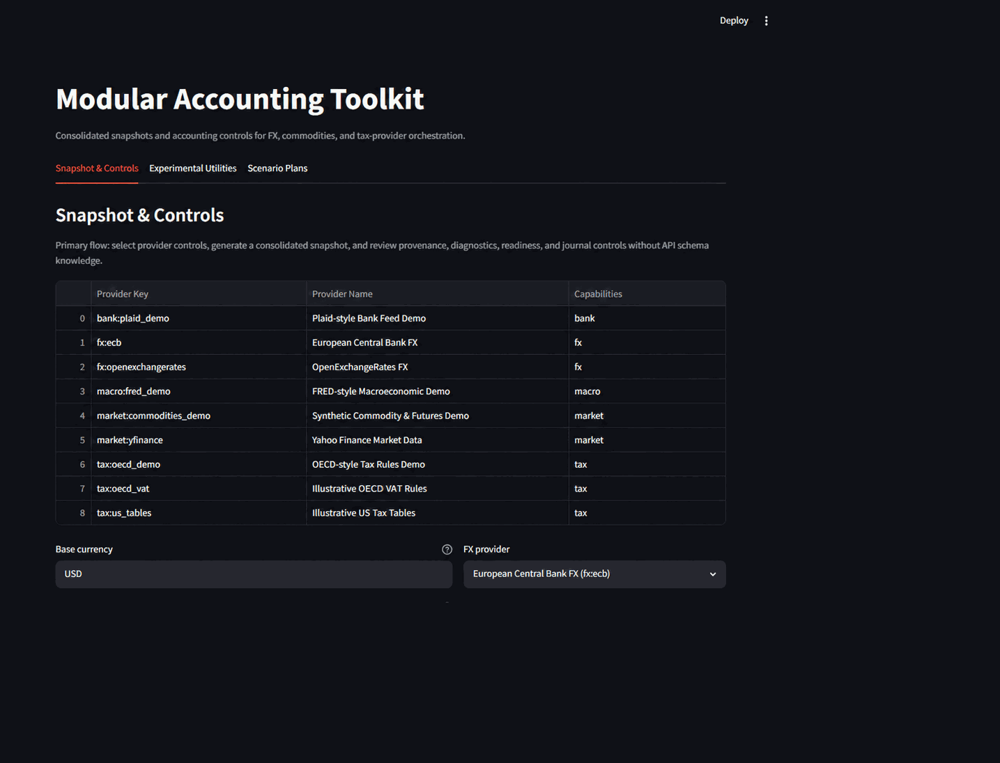
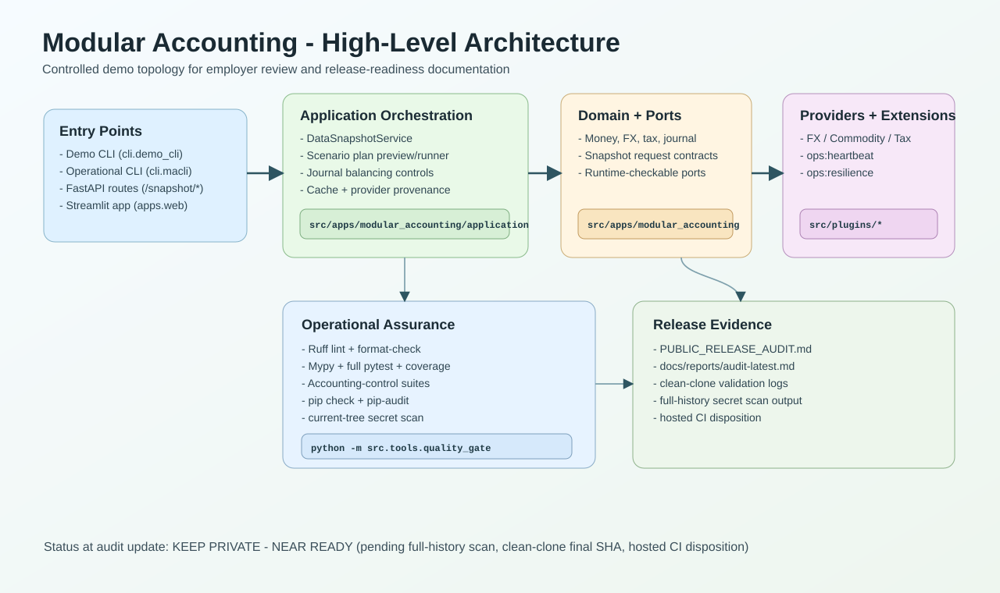
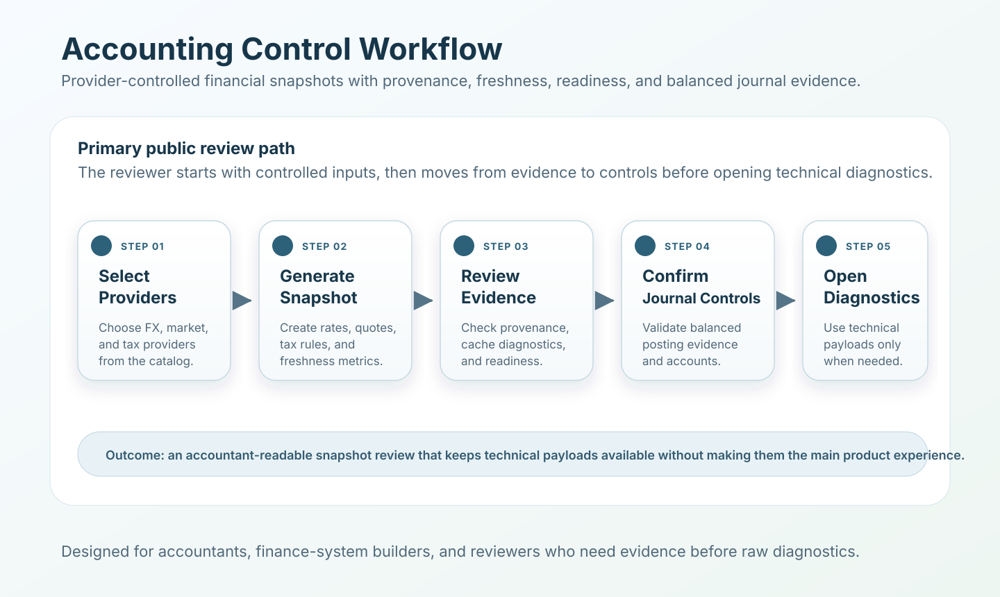

# Modular Accounting

A modular accounting-control toolkit for validating financial snapshots, provider provenance, and journal integrity without committing to a full ERP.

> [!IMPORTANT]
> **EARLY BETA / PORTFOLIO PREVIEW**
>
> This repository demonstrates accounting-control architecture and workflow evidence. Demo providers use controlled sample data unless external credentials are configured. It is not an ERP, production tax engine, bank-feed product, treasury platform, or commercially supported accounting system. Independently validate accounting, tax, security, data, and deployment behavior before relying on any result.

The project demonstrates how accounting workflows can be broken into auditable modules: period close, account reconciliation, budget variance review, journal approvals, FX rates, commodity pricing, tax rules, ledger controls, provider health, cache diagnostics, and scenario plans. It is intentionally smaller than an ERP and focused on transparent controls, reproducible evidence, and clean integration boundaries.

Version 0.2 adds an authenticated Accountant Close Workspace. A controlled close cycle coordinates inclusive accounting periods, serialized posting gates, required balance-sheet reconciliation scope, current-run variance review, explicit journal-approval modes, one effective checklist, and evidence bound to both close content and authoritative ledger activity. Posting is frozen while a cycle awaits approval; administrator-only, reasoned policy exceptions are typed and audited. Final close and a deterministic `CLOSED` evidence record commit atomically. These controls remain an Early Beta demonstration; they are not automatic bank reconciliation, production close certification, or regulatory compliance.

Version 0.4 adds persistent, tenant-aware provider governance. Operators reconcile the current `settings.allowed_providers` trust set into safe registration evidence; organization administrators may only narrow that set through enablement policy and deterministic capability defaults. Members can inspect effective state, conformance, compatibility, provenance, and credential-variable presence through authenticated API and Streamlit surfaces. Persisted rows never authorize Python modules, credential values are never stored or returned, and this workspace is not a provider marketplace or certification program.

The Streamlit **Snapshot Review** remains a public/local controlled demonstration. Its selector is derived only from conforming providers in the current process trust configuration and its local `SnapshotOrchestrator` does not read organization policy or defaults. Provider Governance, Scenario Plan Review, Review Utilities, and tenant API operations remain authenticated and organization-scoped. Signing in does not silently change Snapshot Review to tenant-governed semantics.

## Streamlit demonstration interface using controlled sample data



Demo providers use controlled sample data unless external API credentials are configured. The public review flow is intended to show provider-swappable controls, provenance, and journal evidence without claiming to be a production tax, treasury, or bank-feed system.

## Who This Is For

- Accountants who want clearer control evidence around rates, rules, and journal postings.
- Finance-system builders who need provider-swappable architecture.
- Hiring managers reviewing accounting automation, data provenance, and operational discipline.
- Developers building small, auditable accounting modules instead of monolithic ERP features.

## Why This Toolkit Matters

- Accounting teams need reproducible controls even when data providers change.
- Finance-systems teams need clear provenance, freshness, and health visibility.
- Hiring managers need concrete evidence of modular architecture plus operational quality gates.

## Scope

| This project demonstrates | This project does not claim to be |
|---|---|
| Provider-backed financial snapshots | A full ERP |
| FX, commodity, and tax-rule orchestration | A production tax engine |
| Balanced journal-control examples | A complete GL/subledger platform |
| Provenance, diagnostics, and health checks | Treasury execution software |
| CLI/API/Streamlit review surfaces | A commercial accounting product |
| Controlled period close and reconciliation evidence | ERP-complete financial close certification |

## Verified Core Capabilities

- Consolidated snapshot orchestration across FX, commodity, and tax providers.
- Provider provenance, cache metrics, freshness diagnostics, and readiness/health visibility.
- Journal control primitives for balanced postings and account traceability.
- Operational CLI and API surfaces for snapshot, scenario plans, and diagnostics.
- Regression-tested Streamlit interface focused on snapshot controls for portfolio review.
- Authenticated close-cycle workspace with tenant-scoped lifecycle, readiness, evidence, and explicit separation of duties.
- Authenticated provider-governance workspace with persistent organization policy, revision-protected defaults, audit evidence, and allowlist-enforced runtime resolution.

## Architecture Diagram



## Accounting Control Workflow



The public/local Snapshot Review path is evidence-first: choose a process-trusted provider, run a controlled financial snapshot, review source evidence and freshness, confirm journal-control status, then open technical diagnostics only when needed. Organization policy is reviewed separately through the authenticated Provider Governance workspace.

## Quick-Start Demonstration

1. Create and activate a virtual environment, then install the validated development requirements:

```bash
python -m venv .venv
source .venv/bin/activate
python -m pip install --upgrade pip
python -m pip install -r requirements-dev.txt
export PYTHONPATH="$PWD/src${PYTHONPATH:+:$PYTHONPATH}"
```

On Windows PowerShell:

```powershell
python -m venv .venv
.\.venv\Scripts\Activate.ps1
python -m pip install --upgrade pip
python -m pip install -r requirements-dev.txt
$env:PYTHONPATH = "$PWD\src"
```

2. Start the API:

```bash
python -m uvicorn apps.api.main:app --host 127.0.0.1 --port 8000
```

3. Run the Streamlit demonstration in another activated shell:

```bash
streamlit run src/apps/web/app.py
```

To create the deterministic three-user close example in a fresh local database, set `MODACCT_DATABASE_URL`, run `python scripts/seed_close_demo.py`, and sign in through the Streamlit **API Session** sidebar. The script prints the controlled organization, cycle, budget, staged-workflow, account, and user identifiers. The complete walkthrough is in [`docs/examples/accountant_month_end_close.md`](docs/examples/accountant_month_end_close.md).

4. Optional CLI snapshot and scenario proof:

```bash
python -m cli.macli snapshot --base USD --commodity XAU --jurisdiction US --format table
python -m cli.macli inspect-plan --plan docs/examples/scenario-plan.json
python -m cli.macli snapshot-scenarios --plan docs/examples/scenario-plan.json --format table
python -m cli.macli provider-sdk governance-validate --format table
```

For Docker Compose, configuration, validation, and troubleshooting, use the [setup guide](docs/setup.md).

## Portfolio Review Links

- [Foreign-currency accounting case study](docs/examples/foreign_currency_accounting_case_study.md)
- [End-to-end snapshot and control demonstration](docs/examples/end_to_end_snapshot_demo.md)
- [Provider governance controlled walkthrough](docs/examples/provider_governance_walkthrough.md)
- [Public release audit evidence](PUBLIC_RELEASE_AUDIT.md)
- [Latest audit metrics snapshot](docs/reports/audit-latest.md) - technical supporting evidence only; see the public audit for the release verdict.

## Testing And Release Evidence

- Local and clean-clone quality-gate evidence is tracked in [PUBLIC_RELEASE_AUDIT.md](PUBLIC_RELEASE_AUDIT.md).
- Hosted CI run evidence and artifact disposition are tracked in the same audit file.
- The digest-pinned container lock, SBOM, checksum, and trusted-event attestation
  design is documented in the [container supply-chain guide](docs/container-supply-chain.md).
- Changelog and release notes live in [docs/CHANGELOG.md](docs/CHANGELOG.md) and [docs/RELEASE_NOTES.md](docs/RELEASE_NOTES.md).

## Repository Structure

| Path | Description |
| ---- | ----------- |
| [src/apps/](src/apps/README.md) | Implemented Python service packages, including the Streamlit demonstration interface in `src/apps/web/app.py`. |
| [apps/web/app.py](apps/web/app.py) | Compatibility and test launcher shim that executes `src/apps/web/app.py`. |
| `apps/react-ui/` | Experimental React source directory (not part of the validated accounting runtime). |
| [src/cli/](src/cli/README.md) | Demo and operational CLI entry points. |
| [src/plugins/](src/plugins/README.md) | Provider and extension reference plugins. |
| [src/tools/](src/tools/README.md) | Quality-gate, audit, and release tooling. |
| [docs/](docs/README.md) | Architecture, examples, operations, governance, and reports. |
| [tests/](tests/README.md) | Full regression suites, including Streamlit AppTest coverage. |

## Additional Documentation

- [Setup guide](docs/setup.md)
- [Reproducible container supply chain](docs/container-supply-chain.md)
- [Architecture overview](docs/architecture/overview.md)
- [Adapter contracts](docs/adapters.md)
- [Extension guide](docs/guides/extension_guide.md)
- [Operations playbook](docs/operations/automation_playbook.md)
- [Security and dependency posture](docs/SECURITY.md)
- [Roadmap](docs/roadmap.md)

## License And Contribution

This repository is licensed under the [Apache License 2.0](LICENSE). Attribution is recorded in [NOTICE](NOTICE).

Contributions are welcome. Review [docs/CONTRIBUTING.md](docs/CONTRIBUTING.md), [docs/CODE_OF_CONDUCT.md](docs/CODE_OF_CONDUCT.md), and [docs/SECURITY.md](docs/SECURITY.md) before opening a change.
